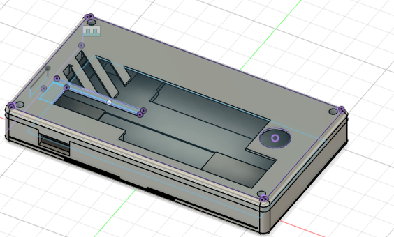
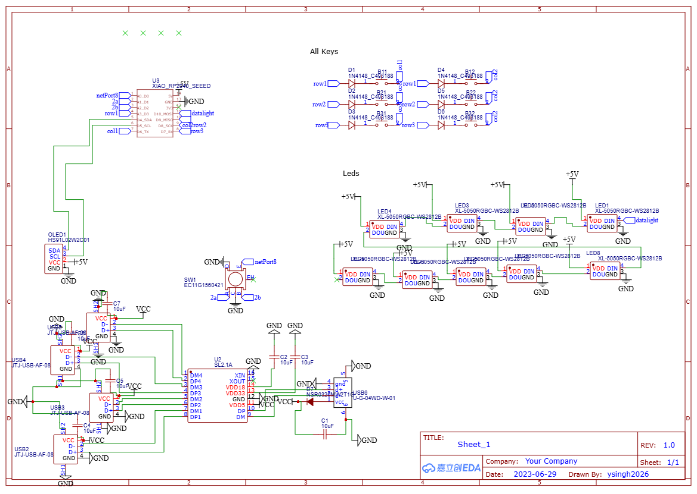

# USB Hub Macro Pad with Customizable Keys
[Read the project build journal](journal.md) for detailed progress updates and technical notes.

## Description
This is a custom-built USB hub macro pad that combines a 4-port USB hub with programmable macro keys and RGB lighting. The device features Kailh mechanical switches for macro functions, customizable key bindings, an OLED display, rotary encoder, and acts as a powered USB hub for connecting multiple devices. Built around a XIAO RP2040 microcontroller that handles both USB hub functionality and macro key programming with WS2812B RGB LEDs for visual feedback.

## Why I Made This
I wanted to create a versatile desktop accessory that serves dual purposes - providing additional USB ports while offering quick access to frequently used commands, shortcuts, and macros. This eliminates the need for separate devices and creates a clean, efficient workspace setup. The RGB lighting and OLED display add visual feedback and customization options.

## Features
- 4-port USB hub functionality
- 6 programmable macro keys with Kailh switches
- RGB LED lighting (WS2812B)
- OLED display for status and information
- Rotary encoder for navigation/volume control
- Custom 3D printed case
- XIAO RP2040 microcontroller for programming flexibility

## Images
### Physical Build (not done yet)

### Full 3D Model

### Wiring Diagram

## Bill of Materials (BOM)
For the complete bill of materials with all components, pricing, and supplier information, see [bom.csv](bom.csv).

**Total Project Cost: $30.19** (including PCB, shipping, and taxes)

Key components include:
- XIAO RP2040 microcontroller
- 6x Kailh mechanical switches
- 9x WS2812B RGB LEDs
- OLED display
- Rotary encoder
- USB hub controller and connectors
- Custom PCB and 3D printed case

