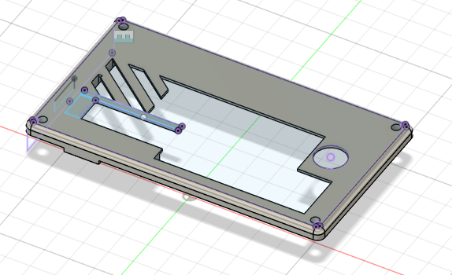

### Date: 2025-07-18  
**Time Spent:** 2 hours  
**Task:** Design — Creating USB Hub Macro Pad Schematic  

**Summary:**  
I spent time designing the complete schematic for the USB hub macro pad project. The goal was to create a device that combines a 4-port USB hub with 8 programmable macro keys and a rotary encoder in a single compact unit.

**Schematic Design Overview:**  
- **USB Hub Section:** Based on a USB 3.0 hub controller chip that provides 4 downstream ports from a single upstream connection. Includes proper power management and signal routing.
- **Macro Pad Section:** Features 8 Cherry MX mechanical switches arranged in a 2x4 grid layout, plus one rotary encoder with push button functionality, all connected to a Xiao ESP32-C3 for key scanning and macro programming.
- **Power Distribution:** Single USB connection provides power for both the hub functionality and the microcontroller. Includes voltage regulation and filtering circuits.
- **Key Matrix:** Implemented a simplified matrix to minimize GPIO pin usage on the Xiao ESP32 while supporting reliable key detection.
- **Rotary Encoder Integration:** Connected to dedicated GPIO pins for rotation detection and push button input, providing additional macro functionality.
- **Wireless Capability:** Xiao ESP32-C3 enables potential wireless macro functionality and configuration via WiFi/Bluetooth.
- **USB Connectivity:** Separate USB data lines for the hub controller and Xiao ESP32, allowing independent operation of both functions.
- **Connector Layout:** Strategic placement of USB-A ports on the back/side for easy cable management, with the upstream USB-C connector positioned for desktop use.

**Key Features Implemented:**
* Simultaneous USB hub and macro pad operation
* 8 customizable macro keys plus rotary encoder control
* Wireless configuration capability via ESP32
* Compact form factor suitable for desktop placement
* Single cable connection to host computer

The schematic is complete and ready for PCB layout design. Next step will be creating the physical board layout and component placement.

---

### Date: 2025-07-19  
**Time Spent:** 2.5 hours  
**Task:** PCB Design — Creating Custom PCB Layout  

**Summary:**  
Completed the PCB design for the USB hub macro pad using the schematic created yesterday. The board integrates both the USB hub controller and the Xiao ESP32-C3 with the mechanical switches and rotary encoder.

**PCB Design Features:**
- **Compact Layout:** Optimized board size to fit within the planned enclosure dimensions
- **Switch Placement:** 8 Cherry MX switches arranged in a 2x4 grid with proper spacing for standard keycaps
- **Rotary Encoder Position:** Centrally located for easy access and ergonomic use
- **USB Hub Integration:** Hub controller and USB-A connectors positioned on the rear edge
- **Power Management:** Dedicated power regulation section with filtering capacitors
- **Ground Planes:** Proper ground plane design for signal integrity and EMI reduction
- **Via Placement:** Strategic via placement for clean routing between layers
- **Component Accessibility:** Xiao ESP32-C3 positioned for easy programming access

**Routing Challenges Solved:**
- Minimized trace crossovers using a 2-layer board design
- Proper impedance control for USB differential pairs
- Clean separation between digital and analog power domains
- Adequate trace width for current carrying capacity

The PCB design is complete and ready for fabrication. Next step will be ordering the PCB and components for assembly.

---

---

### Date: 2025-07-19  
**Time Spent:** 1.5 hours  
**Task:** Design — Creating 3D Printed Case  

**Summary:**  
Designed the 3D printed enclosure for the USB hub macro pad to house the custom PCB and provide a professional desktop appearance. The case needed to accommodate all components while ensuring easy access to ports and switches.

**Case Design Features:**
- **Two-Part Design:** Separate top and bottom shells for easy assembly and PCB access
- **Switch Cutouts:** Precision holes for 8 Cherry MX switches with proper clearance
- **Rotary Encoder Opening:** Central cutout sized for the rotary encoder with push button access
- **USB Port Access:** Rear-facing slots for 4 USB-A connectors with proper spacing
- **Cable Management:** Side channel for the upstream USB-C cable with strain relief
- **Ventilation:** Small vents to prevent heat buildup from the ESP32 and hub controller
- **Mounting Points:** Internal standoffs for secure PCB mounting with M3 screws
- **Ergonomic Design:** Low-profile design with slight angle for comfortable desktop use

**Design Considerations:**
- Wall thickness optimized for 3D printing (2mm minimum)
- Draft angles added for clean print removal
- Fillets on internal corners to reduce stress concentration
- Snap-fit features for tool-free assembly
- Recessed areas for keycaps to sit flush with top surface

The case design is complete and ready for 3D printing. Files exported as STL for slicing.

---

---

### Date: 2025-07-20  
**Time Spent:** 3 hours  
**Task:** Software Development — Arduino Code for Macro Pad  

**Summary:**  
Developed comprehensive Arduino code for the Xiao ESP32-C3 that handles key matrix scanning, rotary encoder input, USB HID functionality, and wireless configuration. The software provides a complete macro pad solution with web-based configuration.

**Software Features Implemented:**

**Core Functionality:**
- Key matrix scanning for 8 Cherry MX switches (2x4 grid)
- Rotary encoder handling with rotation and button press detection
- USB HID keyboard emulation for macro execution
- Debouncing for reliable key detection
- Non-blocking main loop for responsive operation

**Macro System:**
- Configurable macro storage for each key and encoder action
- Support for both text strings and key combinations
- Modifier key support (Ctrl, Alt, Shift, etc.)
- Media key support for volume and playback control
- EEPROM storage for persistent configuration

**Web Configuration Interface:**
- WiFi Access Point mode for easy setup
- Web-based configuration page with HTML/JavaScript
- Real-time macro editing and testing
- JSON API for configuration management
- Default macro presets for common shortcuts

**Key Mapping Features:**
- Copy, Paste, Undo, Save shortcuts
- Browser tab management (New/Close)
- Find and Select All functions
- Volume control via encoder rotation
- Mute toggle on encoder button press

The code is functionally complete with placeholder GPIO pin definitions. Next step will be updating pin assignments based on the actual PCB layout